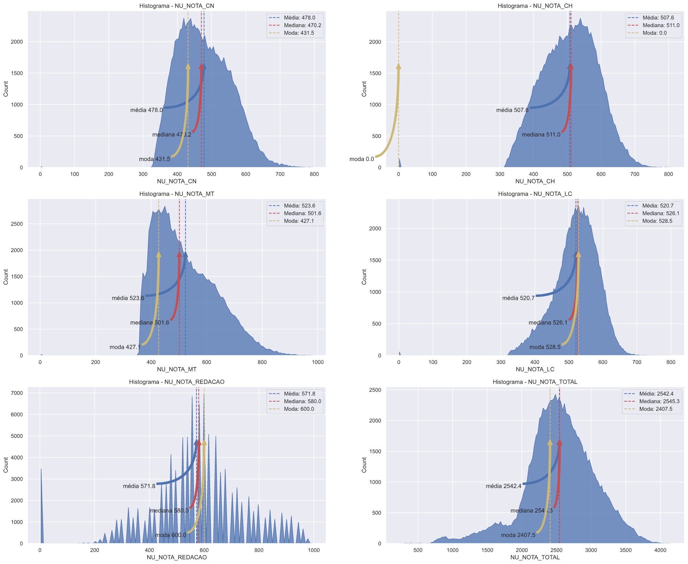

## Alura Imersão Dados 2

2º Imersão de Dados realizada pela Alura, foi utilizado uma amostra dos dados do ENEM 2019, onde foram 5 aulas e desafios por aula. Realizei diversos cruzamento de dados, abaixo deixo um gráfico(spoiler) da minha participação.

⚠️ O GitHub não está renderizando o notebook DesafiosAula03, acredito que seja pelo tamanho que ficou, segue link do Colab com um único arquivo contedo os desafios.

  

